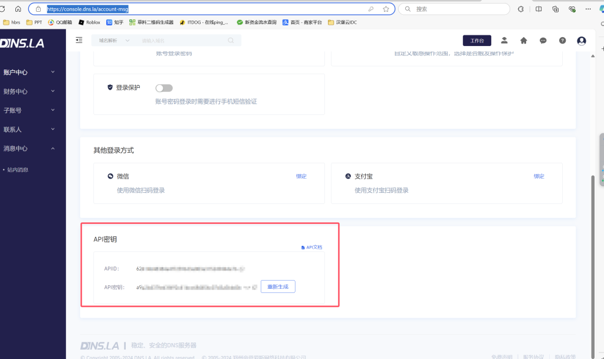
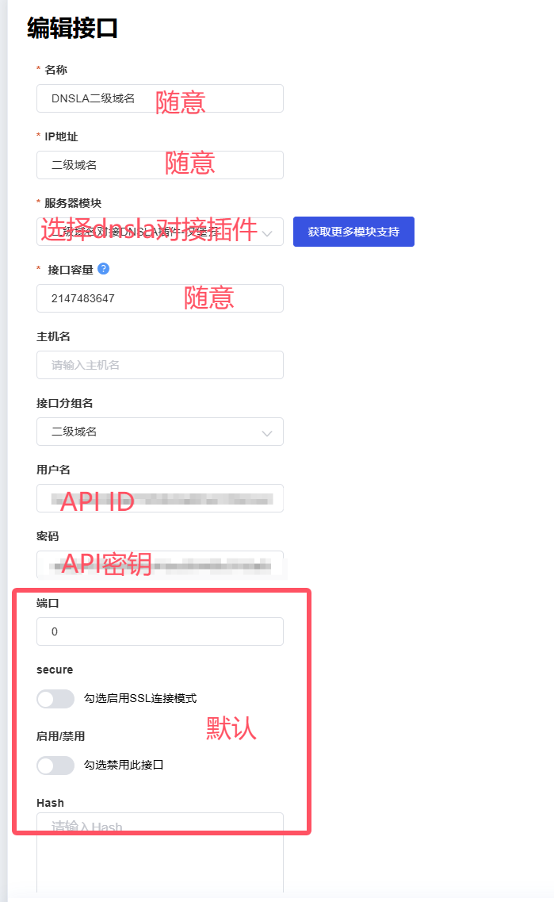
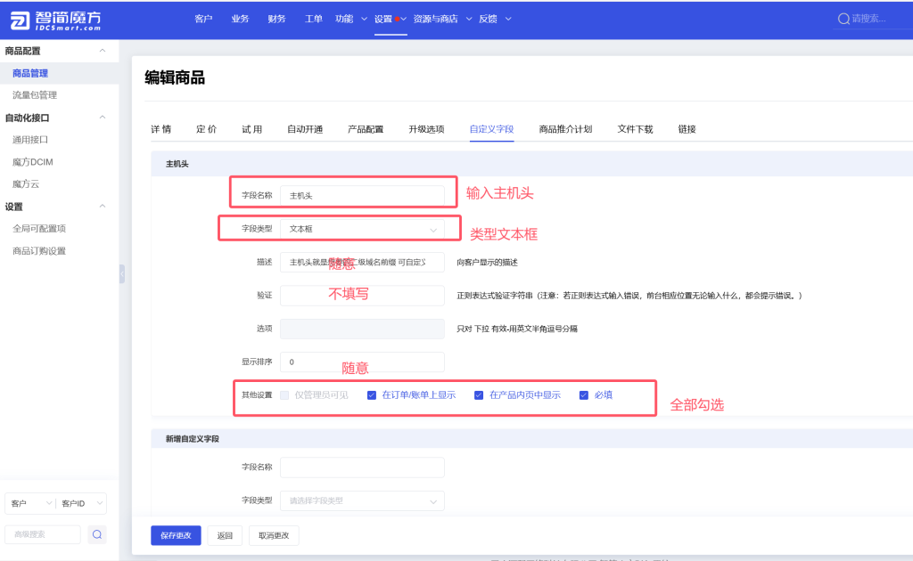
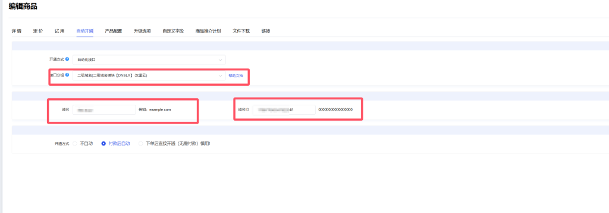
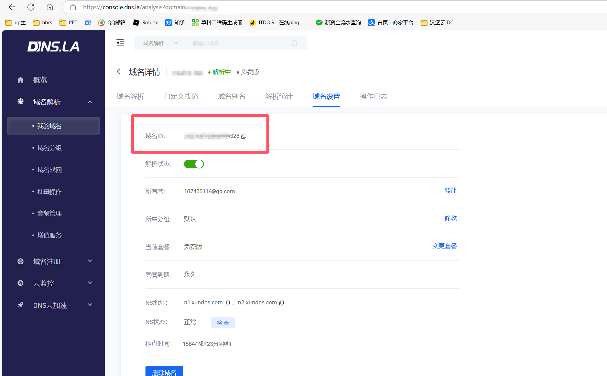

# 智简魔方财务对接DNSLA二级域名模块

## 核心功能

  * **自动化供应**：通过魔方财务自动化接口创建二级域名进行解析
  * **客户端功能**：客户可在魔方财务的用户中心管理和随意解析二级域名。
  * **安全隔离**：插件代码全开源，没有任何后门。
-----
## 使用教程
* **第一步；在DNSLA获取密钥和API**
 
* **第二步：添加服务器模块按图填写(绿色为正常)**
  
* **第三步：新建产品(配置主机头)**
  
* **第四步：配置产品自动化接口**
  
  
  * **第五步：测试开通(产品类型虚拟主机/其他产品。不能选择域名)**
 
    
## 捐赠我
朱波家境贫寒，希望可以捐赠
 
